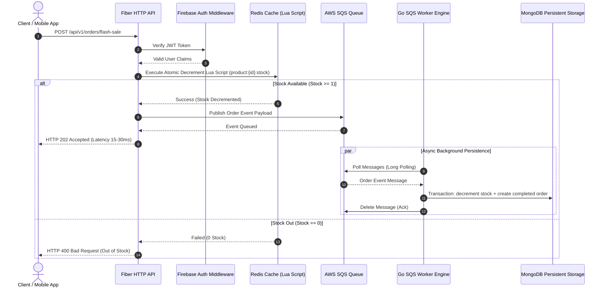

# 🚀 High-Concurrency Order & Flash Sale Engine (Golang)

[](https://go.dev)
[](https://blog.cleancoder.com/uncle-bob/2012/08/13/the-clean-architecture.html)
[](https://www.docker.com/)

A production-oriented reference implementation of a **Flash Sale & E-Commerce Order Engine** built in **Go** with Clean Architecture. Redis provides atomic inventory reservation, SQS buffers traffic spikes, and the worker commits the order plus persistent inventory change in one MongoDB transaction.

---

## 🏗️ System Architecture & Data Flow



---

## 🌟 Key Technical Highlights

1. **Clean Architecture Blueprint**: Strict separation of concerns between `domain`, `usecase`, `repository`, and `delivery`. Easily testable with mocks.
2. **Atomic Inventory Reservation**: Uses a Redis Lua script (`DECRBY` with a stock check) so concurrent API requests cannot drive Redis inventory below zero.
3. **Event-Driven Asynchronous Pipeline**: API responds with `HTTP 202 Accepted` within 15-30ms by delegating persistent DB operations to **AWS SQS** message queues.
4. **Resilient Background Worker Engine**: Processes SQS batches concurrently and uses a MongoDB transaction plus a unique `order_id` index for durable idempotency. Failed messages are retried and moved to a DLQ after three receives.
5. **Security & Media**: Integrated Firebase JWT authentication middleware and **AWS S3 Presigned URLs** for direct client-side product image uploads without proxying payload through API servers.

---

## 🛠️ Tech Stack Matrix

| Module / Component | Technology / Library | Purpose & Rationale |
| :--- | :--- | :--- |
| **Language** | Go 1.25 | High performance, lightweight goroutines, sub-millisecond execution |
| **HTTP Framework** | Fiber v2 | Express-like syntax with FastHTTP engine under the hood |
| **Primary Database** | MongoDB (mongo-go-driver) | Flexible document model for e-commerce catalog & order histories |
| **Cache & Lock** | Redis (go-redis/v9) | In-memory stock pre-warming & atomic Lua script execution |
| **Message Queue** | AWS SQS / LocalStack | System decoupling and async order persistence |
| **Cloud Storage** | AWS S3 / LocalStack | Direct presigned URL uploads for product media |
| **Authentication** | Firebase Admin SDK | Enterprise-grade JWT token validation |
| **Testing & Benchmark** | Testify & k6 | Mocking framework & distributed load testing script |

---

## 📁 Directory Structure (Standard Go Project Layout)

```plaintext
flashsale-go/
├── cmd/
│   ├── api/
│   │   └── main.go                  # Entry point for HTTP Web API Server
│   └── worker/
│       └── main.go                  # Entry point for SQS Consumer Worker Engine
├── internal/
│   ├── domain/                      # [Layer 1] Core Domain Models & Repository Contracts
│   │   ├── user.go
│   │   ├── product.go
│   │   ├── order.go
│   │   └── repository.go
│   ├── usecase/                     # [Layer 2] Pure Business Logic
│   │   ├── auth_usecase.go
│   │   ├── product_usecase.go
│   │   └── order_usecase.go
│   ├── repository/                  # [Layer 3] Data Source Implementations
│   │   ├── mongodb/                 # MongoDB queries (Products, Orders)
│   │   ├── redis/                   # Redis Cache, Lua Scripts & SETNX Locks
│   │   ├── aws/                     # AWS S3 Presigned URLs & SQS Messaging
│   │   └── firebase/                # Firebase Auth Client & Dev Mode Token Verifier
│   └── delivery/                    # [Layer 4] Transport Layer
│       └── http/
│           ├── handler/             # Fiber Controllers
│           ├── middleware/          # JWT Middleware & Rate Limiter
│           └── router.go            # API Endpoint Registration
├── pkg/                             # Shared Utilities
│   ├── config/                      # Environment Loader (Godotenv)
│   ├── logger/                      # Structured Logger
│   └── utils/                       # Standardized JSON Response Helpers
├── scripts/                         # LocalStack Init & k6 Load Test Scripts
├── docker-compose.yml               # Local Infrastructure (Mongo, Redis, LocalStack, API, Worker)
├── Dockerfile                       # Multi-stage production container build
├── go.mod
└── .env.example
```

---

## ⚡ Quickstart Guide

### Prerequisites
- [Docker Desktop](https://www.docker.com/) installed and running.

### 1. Spin-up Infrastructure & Services
Run the following single command to start MongoDB, Redis, LocalStack (SQS & S3), Fiber API, and Worker Engine:

```bash
docker compose up --build -d
```

### 2. Check Health Status
```bash
curl http://localhost:8080/health
```
Response:
```json
{
  "service": "flashsale-go-api",
  "status": "healthy"
}
```

---

## Production Deployment (Render + MongoDB Atlas + AWS)

`render.yaml` now describes a production topology: one API web service, one SQS worker, and one managed Redis service. It intentionally requires real credentials and does not enable development authentication.

Before deploying, create:

- a MongoDB Atlas database user restricted to the application database and the production network;
- a Firebase service-account JSON document;
- an AWS SQS queue (with a dead-letter queue) and an S3 bucket with least-privilege IAM credentials;
- a public frontend/API origin for `ALLOWED_ORIGINS`.

In Render, create a Blueprint from this repository and fill every `sync: false` variable. Required secrets include `MONGO_URI`, `FIREBASE_CREDENTIALS_JSON`, `AWS_ACCESS_KEY_ID`, `AWS_SECRET_ACCESS_KEY`, `AWS_SQS_QUEUE_URL`, `AWS_S3_BUCKET`, and `ALLOWED_ORIGINS`.

Render supplies `PORT`; the application exposes `/health` for liveness and `/ready` for MongoDB/Redis readiness. Do not set `FIREBASE_DEV_MODE=true`, use mock bearer tokens, or use `0.0.0.0/0` in a production MongoDB network rule.

### Local development

Use `docker compose up --build -d` with `.env.example` values. Local development may use Firebase mock tokens, LocalStack, and the in-memory queue, but those settings must never be copied to a production environment.

---

## 📊 API Documentation & Monitoring Portals

| Portal / Feature | URL / Access Path | Description |
| :--- | :--- | :--- |
| **📖 Interactive Swagger UI** | `http://localhost:8080/swagger/index.html` | Test API endpoints interactively in browser |
| **📊 Grafana Dashboard** | `http://localhost:3000` *(admin/admin)* | Real-Time HTTP RPS & Latency P95/P99 Dashboards |
| **📈 Prometheus Metrics** | `http://localhost:8080/metrics` | Prometheus raw metrics endpoint |
| **Readiness Probe** | `GET /ready` | Verifies MongoDB and Redis connectivity |
| **📡 SSE Order Stream** | `GET /api/v1/orders/:id/stream` | Real-time Server-Sent Events status feed |

---

## 📊 API Endpoint Specification

| Method | Endpoint | Description | Auth Required |
| :--- | :--- | :--- | :---: |
| `GET` | `/api/v1/products` | List all active products | ❌ |
| `GET` | `/api/v1/products/:id` | Get product details by ID | ❌ |
| `POST` | `/api/v1/products` | Create a new product | 🔑 |
| `POST` | `/api/v1/products/prewarm` | Pre-warm stock into Redis key | 🔑 |
| `GET` | `/api/v1/upload-url` | Generate S3 Presigned Upload URL | 🔑 |
| `POST` | `/api/v1/orders/flash-sale` | **High-Concurrency Flash Sale Order** | 🔑 |
| `GET` | `/api/v1/orders/:id` | Fetch order details by Order ID | 🔑 |
| `GET` | `/api/v1/orders/:id/stream` | **Real-Time SSE Order Status Stream** | 🔑 |

> **Note for Dev Testing**: When `FIREBASE_DEV_MODE=true`, mock tokens may be used locally. Production always requires a Firebase ID token and real service-account credentials.

---

## 🧪 Testing, Race Condition Audit & SLA Benchmark

### Run Unit Tests & Race Integration Tests
```bash
go test -v ./...
```

### Run Stress Load Test (k6)
Simulate **2,000+ concurrent buyers** competing for flash sale items:

```bash
k6 run scripts/load_test.js
```

### Benchmark methodology

See [BENCHMARK.md](BENCHMARK.md) for reproducible commands, expected correctness checks, and the distinction between unit-level concurrency tests and end-to-end k6 measurements. Throughput numbers are not claimed until raw k6 output and test-machine details are recorded.

## 🤝 Git Workflow & Semantic Commits

This repository adheres to standard Conventional Commit guidelines:
- `feat:` New features (e.g. `feat: add atomic lua stock decrement script`)
- `fix:` Bug fixes (e.g. `fix: handle SQS message delete retry logic`)
- `refactor:` Code restructuring without changing behavior
- `docs:` Documentation updates
