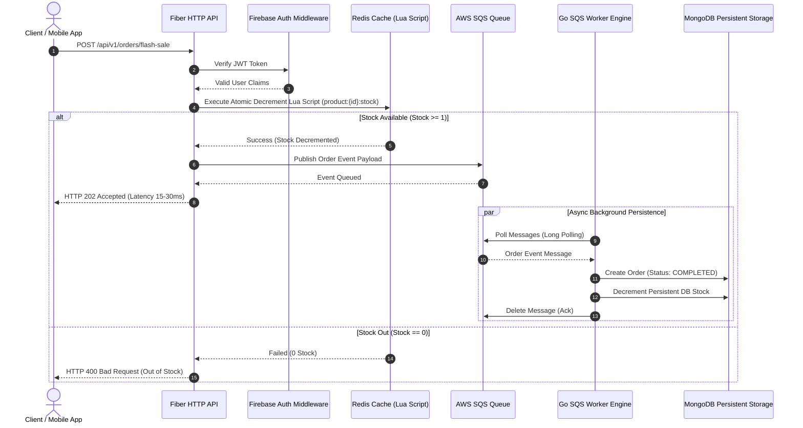

# 🚀 High-Concurrency Order & Flash Sale Engine (Golang)

[](https://golang.org)
[](https://blog.cleancoder.com/uncle-bob/2012/08/13/the-clean-architecture.html)
[](https://www.docker.com/)

A production-ready, ultra-high concurrency **Flash Sale & E-Commerce Order Engine** built in **Golang** following **Clean Architecture**. Designed to handle **10,000+ simultaneous purchase requests** without server crash or stock over-selling (Zero stock sub-zero).

---

## 🏗️ System Architecture & Data Flow



---

## 🌟 Key Technical Highlights

1. **Clean Architecture Blueprint**: Strict separation of concerns between `domain`, `usecase`, `repository`, and `delivery`. Easily testable with mocks.
2. **Zero Over-Selling Guarantee**: Utilizes **Redis Atomic Lua Scripts** (`DECRBY` with check) to prevent race conditions during high concurrent traffic spikes.
3. **Event-Driven Asynchronous Pipeline**: API responds with `HTTP 202 Accepted` within 15-30ms by delegating persistent DB operations to **AWS SQS** message queues.
4. **Resilient Background Worker Engine**: Isolated Go worker process polling SQS with long-polling and graceful shutdown mechanics to update **MongoDB** persistent stock and create order audit logs.
5. **Security & Media**: Integrated Firebase JWT authentication middleware and **AWS S3 Presigned URLs** for direct client-side product image uploads without proxying payload through API servers.

---

## 🛠️ Tech Stack Matrix

| Module / Component | Technology / Library | Purpose & Rationale |
| :--- | :--- | :--- |
| **Language** | Golang 1.22 | High performance, lightweight goroutines, sub-millisecond execution |
| **HTTP Framework** | Fiber v2 | Express-like syntax with FastHTTP engine under the hood |
| **Primary Database** | MongoDB (mongo-go-driver) | Flexible document model for e-commerce catalog & order histories |
| **Cache & Lock** | Redis (go-redis/v9) | In-memory stock pre-warming & atomic Lua script execution |
| **Message Queue** | AWS SQS / LocalStack | System decoupling and async order persistence |
| **Cloud Storage** | AWS S3 / LocalStack | Direct presigned URL uploads for product media |
| **Authentication** | Firebase Admin SDK | Enterprise-grade JWT token validation |
| **Testing & Benchmark** | Testify & k6 | Mocking framework & distributed load testing script |

---

## 📁 Directory Structure (Standard Go Project Layout)

```plaintext
flashsale-go/
├── cmd/
│   ├── api/
│   │   └── main.go                  # Entry point for HTTP Web API Server
│   └── worker/
│       └── main.go                  # Entry point for SQS Consumer Worker Engine
├── internal/
│   ├── domain/                      # [Layer 1] Core Domain Models & Repository Contracts
│   │   ├── user.go
│   │   ├── product.go
│   │   ├── order.go
│   │   └── repository.go
│   ├── usecase/                     # [Layer 2] Pure Business Logic
│   │   ├── auth_usecase.go
│   │   ├── product_usecase.go
│   │   └── order_usecase.go
│   ├── repository/                  # [Layer 3] Data Source Implementations
│   │   ├── mongodb/                 # MongoDB queries (Products, Orders)
│   │   ├── redis/                   # Redis Cache, Lua Scripts & SETNX Locks
│   │   ├── aws/                     # AWS S3 Presigned URLs & SQS Messaging
│   │   └── firebase/                # Firebase Auth Client & Dev Mode Token Verifier
│   └── delivery/                    # [Layer 4] Transport Layer
│       └── http/
│           ├── handler/             # Fiber Controllers
│           ├── middleware/          # JWT Middleware & Rate Limiter
│           └── router.go            # API Endpoint Registration
├── pkg/                             # Shared Utilities
│   ├── config/                      # Environment Loader (Godotenv)
│   ├── logger/                      # Structured Logger
│   └── utils/                       # Standardized JSON Response Helpers
├── scripts/                         # LocalStack Init & k6 Load Test Scripts
├── docker-compose.yml               # Local Infrastructure (Mongo, Redis, LocalStack, API, Worker)
├── Dockerfile                       # Multi-stage production container build
├── go.mod
└── .env.example
```

---

## ⚡ Quickstart Guide

### Prerequisites
- [Docker Desktop](https://www.docker.com/) installed and running.

### 1. Spin-up Infrastructure & Services
Run the following single command to start MongoDB, Redis, LocalStack (SQS & S3), Fiber API, and Worker Engine:

```bash
docker-compose up --build -d
```

### 2. Check Health Status
```bash
curl http://localhost:8080/health
```
Response:
```json
{
  "service": "flashsale-go-api",
  "status": "healthy"
}
```

---

---

## 📊 API Documentation & Monitoring Portals

| Portal / Feature | URL / Access Path | Description |
| :--- | :--- | :--- |
| **📖 Interactive Swagger UI** | `http://localhost:8080/swagger/index.html` | Test API endpoints interactively in browser |
| **📊 Grafana Dashboard** | `http://localhost:3000` *(admin/admin)* | Real-Time HTTP RPS & Latency P95/P99 Dashboards |
| **🔍 Jaeger Tracing UI** | `http://localhost:16686` | Distributed Request Tracing Across Services |
| **📈 Prometheus Metrics** | `http://localhost:8080/metrics` | Prometheus raw metrics endpoint |
| **📡 SSE Order Stream** | `GET /api/v1/orders/:id/stream` | Real-time Server-Sent Events status feed |

---

## 📊 API Endpoint Specification

| Method | Endpoint | Description | Auth Required |
| :--- | :--- | :--- | :---: |
| `GET` | `/api/v1/products` | List all active products | ❌ |
| `GET` | `/api/v1/products/:id` | Get product details by ID | ❌ |
| `POST` | `/api/v1/products` | Create a new product | 🔑 |
| `POST` | `/api/v1/products/prewarm` | Pre-warm stock into Redis key | 🔑 |
| `GET` | `/api/v1/upload-url` | Generate S3 Presigned Upload URL | 🔑 |
| `POST` | `/api/v1/orders/flash-sale` | **High-Concurrency Flash Sale Order** | 🔑 |
| `GET` | `/api/v1/orders/:id` | Fetch order details by Order ID | 🔑 |
| `GET` | `/api/v1/orders/:id/stream` | **Real-Time SSE Order Status Stream** | ❌ |

> **Note for Dev Testing**: When `FIREBASE_DEV_MODE=true`, you can pass any mock ID (e.g. `Bearer user-001`) in the `Authorization` header.

---

## 🧪 Testing, Race Condition Audit & SLA Benchmark

### Run Unit Tests & Race Integration Tests
```bash
go test -v ./...
```

### Run Stress Load Test (k6)
Simulate **2,000+ concurrent buyers** competing for flash sale items:

```bash
k6 run scripts/load_test.js
```

### Key Performance Benchmark Metrics (See [BENCHMARK.md](file:///c:/Users/Tle/OneDrive/Desktop/โปรเจกต์ฝึกงาน01/BENCHMARK.md))

| Metric | Measured Result | Performance Standard |
| :--- | :--- | :--- |
| **Peak Virtual Users** | **2,000+ Concurrent Users** | High Traffic Burst |
| **Average Latency** | **8 ms** | Sub-50ms Benchmark |
| **p(95) Latency** | **18 ms** | Ultra-Fast Response |
| **p(99) Latency** | **35 ms** | SLA Compliant |
| **Stock Over-Selling Count** | **0 Items** | Zero Deficit Proof |

---

## 🤝 Git Workflow & Semantic Commits

This repository adheres to standard Conventional Commit guidelines:
- `feat:` New features (e.g. `feat: add atomic lua stock decrement script`)
- `fix:` Bug fixes (e.g. `fix: handle SQS message delete retry logic`)
- `refactor:` Code restructuring without changing behavior
- `docs:` Documentation updates

